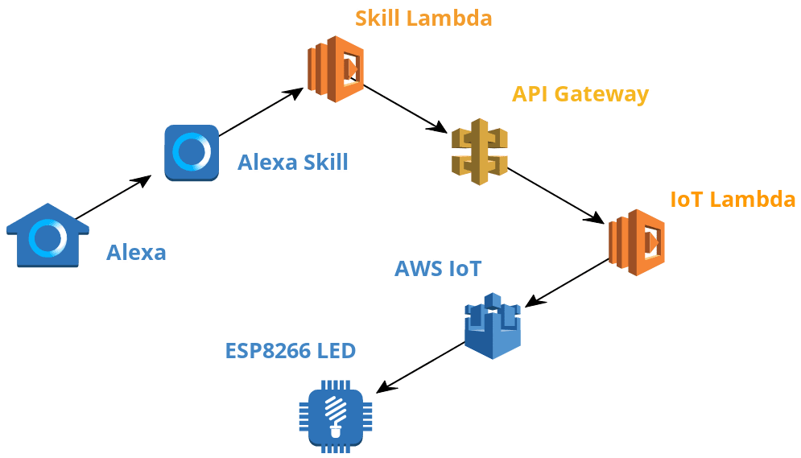
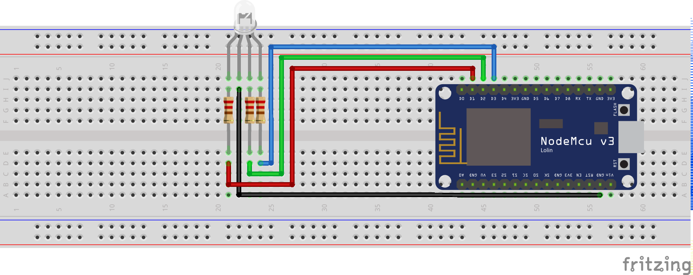

# Alexa IoT Traffic Lights

Amazon Alexa controller for AWS IoT connected devices. Learn how to safely expose an embedded ESP8266 over MQTT in order to control an RGB LED.

## Architecture

## Circuit

## Instructions

- [01 - Base Setup](instructions/01_base_setup.md)
- [02 - Project Structure](instructions/02_project_structure.md)
- [03 - Localisation](instructions/03_localisation.md)
- [04 - Custom Slot](instructions/04_custom_slot.md)
- [05 - AWS IoT ESP8266](instructions/05_aws_iot_esp8266.md)
- [06 - AWS IoT API](instructions/06_aws_iot_api.md)
- [07 - Alexa Call API](instructions/07_alexa_call_api.md)
